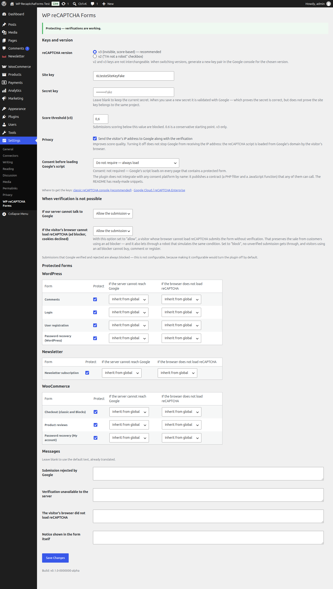

# WP reCAPTCHA Forms

> 🇧🇷 **[Leia em português → README.md](README.md)**

Protects WordPress, WooCommerce and Newsletter forms with Google reCAPTCHA — with a
configurable failure policy, and without breaking page caching.

- **Requires:** PHP 7.4+ · WordPress 6.0+ · (optional) WooCommerce 7.0+ for the classic checkout and 8.3+ for Blocks
- **Licence:** [GPL-2.0-or-later](LICENSE)
- **Status:** in development, no public release yet

---

## Contents

- [Why this plugin exists](#why-this-plugin-exists)
- [Supported forms](#supported-forms)
- [Installation](#installation)
- [Getting your Google keys](#getting-your-google-keys)
- [Configuration](#configuration)
- [When verification is not possible](#when-verification-is-not-possible)
- [Privacy](#privacy)
- [Consent and CMPs](#consent-and-cmps)
- [Kill switch](#kill-switch)
- [Public API](#public-api)
- [FAQ](#faq)
- [Translations](#translations)
- [Licence](#licence)

---

## Why this plugin exists

**The thesis is coverage, not sophistication.** There is no free plugin that covers, in one
place, comments + registration + login + password recovery + newsletter + WooCommerce
checkout (classic **and** Blocks) + product reviews, with both reCAPTCHA v3 and v2. There
are plugins that do some of those forms very well, and paid tiers that do the rest. This
one does the whole list.

What it does **not** do, said up front so you don't find out later:

- **One global score threshold.** That is a design decision, not a limitation: a threshold
  per form multiplies the configuration surface, and the persona that needs it is rare. If
  you do need it, the `wp_recaptcha_forms_verdict` filter hands you the entire decision.
- **No telemetry enabled by default, no reports, no history of blocked submissions.** No
  new database table. There is an optional usage-statistics send, **off by default**,
  which only starts happening if you tick the box under Settings → reCAPTCHA → Telemetry;
  the screen shows you the exact contents before you decide. No plugin update turns it on
  for you. What exists without telemetry is two one-hour transient counters, used only
  for a diagnostic notice, and they expire on their own.
- **It is not legal advice.** The ready-made privacy text (below) is a starting point, and
  it does not make your installation GDPR- or LGPD-compliant.

---

## Supported forms

| Source | Form | `form_id` | Note |
|---|---|---|---|
| WordPress | Comments | `wp_comment` | Does not apply to Woo product reviews (those have their own row) |
| WordPress | Login | `wp_login` | Only the HTML form on `wp-login.php`. XML-RPC, REST, WP-CLI, cron and already-logged-in users are excluded |
| WordPress | User registration | `wp_register` | |
| WordPress | Password recovery | `wp_lostpassword` | |
| Newsletter (Stefano Lissa) | Subscription | `newsletter_subscribe` | |
| WooCommerce | Checkout | `woocommerce_checkout` | Covers both the **classic** (shortcode) and **Blocks** (Store API) paths, with the same verdict |
| WooCommerce | Product reviews | `woocommerce_review` | |
| WooCommerce | Password recovery (My account) | `woocommerce_lostpassword` | |

**Deliberately out of scope:** password reset via emailed link (the link is already the
authentication factor) and any authentication path other than the HTML form on
`wp-login.php`.

---

## Installation

1. Download the `.zip` from the [releases page](https://github.com/gustavo8000br/wp-recaptcha-forms/releases).
2. In the dashboard: **Plugins → Add New → Upload Plugin**, pick the `.zip` and install.
3. Activate.
4. Go to **Settings → WP reCAPTCHA Forms** and enter your keys.

Until you enter a site key and a secret key, the plugin stays in the **"not configured
yet"** state: it prints no field, loads no script and blocks nothing.

---

## Getting your Google keys

There are two paths, and they do **not** produce interchangeable keys.

> **Verified on 2026-09-09.** Google reorganises these pages fairly often; if a link below
> has moved, please open an issue.

### Path 1 — the classic reCAPTCHA console · *recommended*

**https://www.google.com/recaptcha/admin**

1. Sign in with a Google account.
2. Click **+** to register a new site.
3. **Label:** any name that helps you find it later.
4. **Type:** choose **reCAPTCHA v3** (recommended) or **reCAPTCHA v2 → "I'm not a robot"**.
5. **Domains:** your site's domain, with no `https://` and no trailing slash. Add your
   staging domains too — getting this wrong produces an `exec-error` in the visitor's
   browser, not an error in your dashboard.
6. Accept the terms and submit.
7. Copy the **site key** and the **secret key**.

> ⚠️ **Google has marked this console as deprecated**, pushing new projects towards
> reCAPTCHA Enterprise on Google Cloud. It still works and is still free, which is why it
> is still the recommended path here — but expect a migration at some point.

### Path 2 — reCAPTCHA Enterprise via the Google Cloud Console

**https://console.cloud.google.com/security/recaptcha**
(documentation: https://cloud.google.com/recaptcha/docs/create-key-website)

1. Create or select a Google Cloud project.
2. **You must enable billing on the project.** No euphemism: Google requires a card on
   file, even within the free quota. There is a generous monthly free quota for small
   sites, but the billing setup is mandatory and overage is charged.
3. Enable the **reCAPTCHA Enterprise** API.
4. Create a **Website** key, choosing between score-based (equivalent to v3) or checkbox
   (equivalent to v2).
5. Register your domains.
6. The **site key** appears in the listing. The **secret key** is the legacy API key; if
   you are going to use this plugin, generate it under **Legacy settings / Legacy secret
   key** on the same screen.

### Which one to choose

| | Classic console | Enterprise |
|---|---|---|
| Cost | free, no card | requires billing enabled |
| Complexity | 6 clicks | GCP project, API, IAM |
| Future | deprecated | where Google is heading |
| **Recommendation for this plugin** | **yes** | only if you already live in GCP |

### An honest warning about key validation

When you save a new secret key, the plugin tests it against Google right away. That probe
catches the gross error — a secret with one character wrong, a secret pasted into the wrong
field (`invalid-input-secret`).

**It does NOT detect a site key / secret key pair coming from different projects.** Google's
verification endpoint never receives the site key, so there is no way to ask it whether the
two match. That is why the screen says *"secret validated"* and never *"keys validated"* —
the difference is real.

That residual case is caught later, in production, by a runtime advisory: if **every**
recent verification fails (minimum of 10, 100% rejection), the plugin shows a notice saying
the most likely cause is keys from different projects. No verdict changes because of that
notice — it is pure diagnostics.

---

## Configuration

**Settings → WP reCAPTCHA Forms**



| Option | Default | What it does |
|---|---|---|
| reCAPTCHA version | `v3` | v3 is invisible and decides by score; v2 shows the "I'm not a robot" checkbox. **Keys are not interchangeable** |
| Site key / Secret key | empty | The secret is never echoed back; leave the field blank to keep the current one |
| Score threshold | `0.6` | v3 only. Submissions below this are blocked |
| Send IP to Google | on | Improves score quality. See [Privacy](#privacy) |
| Consent | `do not require` | See [Consent and CMPs](#consent-and-cmps) |
| Failure policy (2 axes) | `allow` | See the next section |
| Protected forms | all on | One toggle and two policy axes per form |
| Messages | empty | Blank = use the default text, already translated |

The secret key can also come from `wp-config.php`, outside the database:

```php
define( 'WP_RECAPTCHA_FORMS_SECRET_KEY', 'your-secret-key' );
```

With the constant defined, the field on the screen is disabled and has no `name` — there is
no way to override it from the dashboard.

---

## When verification is not possible

There are **four** possible outcomes, and each has a different owner. It is the most
important design decision in the plugin, so it gets a table:

| Class | What happened | Whose problem it is | Policy | Configurable? |
|---|---|---|---|---|
| **Rejected** | Google answered and rejected the submission | the visitor's (or the bot's) | **always blocks** | **no** |
| **Server can't reach Google** | Your server could not talk to Google | network/infra; you can act | allow (default) | yes, 2 levels |
| **Wrong keys** | Google refused the keys | yours, the operator's | allows + maximum dashboard escalation | via filter |
| **Browser can't reach Google** | The visitor's browser did not load reCAPTCHA | nobody's — it's the world | allow (default) | yes, 2 levels |

**"Rejected" is deliberately not configurable.** Making it configurable would turn the
plugin off by default the first time somebody chose "allow", and it is precisely the one
case where we know Google evaluated the submission and said no.

### What you are buying by leaving "browser can't reach Google" on *allow*

> With this option set to "allow", a visitor whose browser cannot load reCAPTCHA submits the
> form without verification. That preserves the sale from customers using an ad blocker —
> **and it also lets through a robot that simulates the same condition**. Set to "block", no
> unverified submission gets through, and visitors using an ad blocker cannot buy, comment
> or register.

There is no way to make that signal unforgeable: any proof the browser can produce without
talking to Google, a script can produce too. The plugin does not spend complexity pretending
otherwise — it spends it on making the choice explicit.

A bot that simply **sends nothing** is still blocked, even on "allow". The difference between
"sent no token" and "declared it could not obtain a token" is what separates the two cases.

### What the visitor sees

When the browser cannot load reCAPTCHA, a notice appears in the form itself, before the
submission proceeds:

> *Google's security verification could not be loaded. If you use an ad blocker or declined
> cookies, disable it for this page and try again.*

On "allow" it is just a notice — the submission works. On "block", the refusal comes with
its **own** message, different from the "rejected" one: the visitor needs to know the
problem is their ad blocker, not that they were mistaken for a robot.

---

## Privacy

The plugin ships a ready-made notice for you to paste into your privacy policy, **and it
reflects your installation's real configuration** — whether IP sending is on or off, and
whether the script is behind consent.

Three ways to use it:

```php
// 1. Function
echo wp_recaptcha_forms_privacy_notice();
echo wp_recaptcha_forms_privacy_notice( array( 'format' => 'plain' ) );
```

```text
2. Shortcode
[wp_recaptcha_forms_privacy_notice]
[wp_recaptcha_forms_privacy_notice format="plain"]
```

**3. WordPress's native tool:** the text already appears under **Settings → Privacy →
suggested policy text**, next to the other plugins' texts, with a copy button.

### The paragraph to read before turning IP sending off

The *"send the visitor's IP address to Google"* toggle controls **only** the IP that **your
server** sends alongside the verification. Turning it off helps little and misleads a lot:

> Turning that off does **not** stop Google from receiving the visitor's IP address, because
> the reCAPTCHA script is loaded **directly from Google's domain by the visitor's browser**.
> Google sees the IP either way.

The privacy mitigation that actually works in this plugin is a different one, and it is on
by default: **Google's script is only loaded on pages that contain a protected form.** On
any other page of your site, the visitor's browser does not talk to Google because of this
plugin.

### Telemetry — optional, off by default

The plugin can send the author an aggregate usage summary **once a week**: PHP, WordPress
and plugin versions, which forms you protected, your configuration, and the **ratio**
between allowed and blocked submissions. A ratio, not a count: the number of submissions
your site handles is your business volume, and the envelope carries only an
order-of-magnitude bucket.

It does **not** send your site address, e-mails, IP addresses, form content, your
reCAPTCHA keys, or any data about your visitors or customers.

This is **opt-in**: it ships off, and no plugin update turns it on for you. Under
**Settings → reCAPTCHA → Telemetry** there is a *"See exactly what will be sent"* button
that shows the real JSON — produced by the same code that does the sending, not by a
hand-written sample — and it works **with the toggle off**, because nobody should have to
decide about data they can only see after agreeing to send it.

Turning it off deletes the installation's random identifier. If you turn it back on, it is
a new installation with no link to the previous history — not a pause, a clean break.

To turn it off from a file, across a whole fleet:

```php
// wp-config.php — disables telemetry only; the rest of the plugin keeps working.
define( 'WRF_TELEMETRY_DISABLE', true );
```

`WRF_DISABLE` also disables telemetry, along with the entire plugin.

The telemetry API's privacy policy is linked from the settings screen itself.

---

## Consent and CMPs

A correctly configured CMP holds third-party scripts until consent is given. If you have
one, turn on the consent mode:

| Mode | Behaviour |
|---|---|
| `do not require` (default) | Loads the script normally |
| `automatic` | Consults the WP Consent API if present; with no provider, behaves like "do not require" |
| `require` | **Never** loads without an explicit consent signal |

**The plugin does not integrate with any CMP by name.** Maintaining N adapters for N plugins
that change their API without notice is guaranteed debt in a solo-maintainer project.
Instead it publishes a contract — and you connect the two wires in three lines.

### Complianz

```js
document.addEventListener( 'cmplz_status_change', function () {
    if ( cmplz_has_consent( 'marketing' ) ) {
        window.wpRecaptchaForms.grantConsent();
    }
} );
```

### CookieYes

```js
document.addEventListener( 'cookieyes_consent_update', function ( e ) {
    if ( e.detail && e.detail.accepted && e.detail.accepted.includes( 'advertisement' ) ) {
        window.wpRecaptchaForms.grantConsent();
    }
} );
```

> The event and category names above belong to **the CMP**, not to this plugin, and they
> change without telling us. Check your CMP's current documentation; the only part that is
> our contract is the `window.wpRecaptchaForms.grantConsent()` call.

### WP Consent API

Nothing to do: in `automatic` or `require`, the plugin already consults `wp_has_consent()`
when the WP Consent API is present. The category consulted is `marketing`, and it is
filterable — classifying reCAPTCHA as `marketing`, `functional` or `statistics` is your
legal decision, not ours:

```php
add_filter( 'wp_recaptcha_forms_consent_category', fn() => 'functional' );
```

### Anything else

```php
// Server side
add_filter( 'wp_recaptcha_forms_consent_granted', function ( $granted, $form_id ) {
    return isset( $_COOKIE['my_cmp_marketing'] ) ? true : $granted;
}, 10, 2 );
```

```js
// Client side — idempotent, call it as many times as you like
window.wpRecaptchaForms.grantConsent();

// or, by event
document.dispatchEvent( new CustomEvent( 'wp-recaptcha-forms:consent-granted' ) );
```

If consent arrives **while** the form is being filled in, the next submission already has a
token and the visitor never sees a notice at all.

---

## Kill switch

For when something goes wrong at 11pm and `wp-admin` is not an option:

```php
// wp-config.php
define( 'WRF_DISABLE', true );
```

Disables **all** protection immediately, without deactivating the plugin and without
touching the database. No integration is registered, no script is enqueued, no field is
printed, no call to Google is made. Every form goes back to native WordPress behaviour on
the next request.

What deliberately **keeps** working: the settings screen opens and is editable (you need to
be able to fix the key that got you here), a non-dismissible notice appears across the
dashboard, and Site Health reports the state.

`WP_RECAPTCHA_FORMS_DISABLE` works as an alias, with the same semantics.

---

## Public API

To protect a form the plugin does not know about:

```php
// In the form, inside the <form>:
wp_recaptcha_forms_render_field( 'my_form' );

// On validation:
$result = wp_recaptcha_forms_verify( 'my_form' );

if ( is_wp_error( $result ) ) {
    // Returns WP_Error, never an exception: a mandatory try/catch in a form plugin
    // would be a source of somebody else's fatal error.
    wp_die( $result->get_error_message() );
}
```

```php
wp_recaptcha_forms_is_active( 'my_form' );   // bool
wp_recaptcha_forms_set_consent( true );      // server-side consent
wp_recaptcha_forms_privacy_notice();         // privacy text
```

### Filters

| Filter | What for |
|---|---|
| `wp_recaptcha_forms_verdict` | The final decision, in full. The escape hatch for any rule of your own |
| `wp_recaptcha_forms_should_protect` | Turn on/off by context (per page, per user) |
| `wp_recaptcha_forms_client_unreachable_policy` | "Browser can't reach Google" policy, per form |
| `wp_recaptcha_forms_misconfig_policy` | Opt-in fail-close when the keys are wrong |
| `wp_recaptcha_forms_consent_granted` | Server-side consent decision |
| `wp_recaptcha_forms_consent_category` | Category consulted in the WP Consent API |
| `wp_recaptcha_forms_load_timeout` | How long the browser waits for the script (default 4000 ms) |
| `wp_recaptcha_forms_request_timeout` | How long the server waits for Google |
| `wp_recaptcha_forms_remote_ip` | The IP sent with the verification |
| `wp_recaptcha_forms_endpoint` | Swap `google.com` for `recaptcha.net` |
| `wp_recaptcha_forms_privacy_notice_paragraphs` | Adjust the privacy text |
| `wp_recaptcha_forms_locale_fallbacks` | Language variant map |

---

## FAQ

### Does the plugin break page caching?

No, and that is an architectural requirement, not luck. The printed HTML is **identical for
every visitor and cacheable forever**: the hidden fields are printed empty and filled in by
JavaScript at submit time. There is no nonce in a public form — a nonce on a cached page
would be served expired.

**What you still need to check in your caching plugin** is JavaScript optimisation, not HTML
caching.

| Plugin | What to exclude |
|---|---|
| **WP Rocket** | Exclude `wp-recaptcha-forms` and `google.com/recaptcha` from *Delay JavaScript Execution* and *Combine JavaScript files* |
| **LiteSpeed Cache** | Exclude the same two from *JS Combine* and *JS Defer / Delayed JS* |
| **Autoptimize** | Add `wp-recaptcha-forms` and `recaptcha` to the JS exclusion list |
| **Cloudflare** | Turn off *Rocket Loader* for pages with a protected form |

The symptom of having forgotten this is always the same: the form submits, but always
without a token.

### Why is the script loaded only on some pages?

Because loading it everywhere would hand Google every visitor's IP on every page, for no
reason. The plugin registers the script and only enqueues it when some integration declares
it is going to print a field on that request.

### Does a logged-in user have to pass reCAPTCHA on login?

No. If there is already a valid session, there is no bot to stop.

### Does the plugin protect login via the official app, Jetpack or SSO?

No, and that is deliberate. Login protection covers **only** the HTML form on
`wp-login.php`. XML-RPC, the REST API (including application passwords), WP-CLI and cron
pass through untouched — protecting those paths with a browser challenge would only produce
lockouts.

### Can I have a different threshold per form?

Not from the screen. Use `wp_recaptcha_forms_verdict`.

### What happens if Google goes down?

By default, submissions go through (fail-open) and nothing appears in the dashboard — it is
neither your fault nor the visitor's. If you would rather block, switch *"if our server
cannot talk to Google"* to "block".

### Does the plugin create database tables?

No. One settings option, a few state options and two one-hour transients. With telemetry
enabled, one more option holding aggregate counters — still an option, not a table, and it
is not autoloaded. Uninstalling sweeps everything by prefix — including keys from future
features, because the sweep is by prefix and not by a hand-written list.

---

## Translations

The plugin ships translated. `en_US` and `es_ES` are real translations; `pt_BR` is the
language the strings were written in.

<!-- i18n-progress:start -->

| Language | Progress | Strings |
|---|---|---|
| Português (Brasil) — source language (`pt_BR`) | `████████████████████` 100% | 115/115 |
| English (US) (`en_US`) | `████████████████████` 100% | 115/115 |
| Español (`es_ES`) | `████████████████████` 100% | 115/115 |

Generated by `composer i18n:progress` from the actual `.po` files in `languages/`. Do not edit by hand.

<!-- i18n-progress:end -->

Regional variants fall back to the maintained catalogue: `es_MX`, `es_AR`, `es_CO` and ten
more use `es_ES`; `pt_PT` and `pt_AO` use `pt_BR`; `en_GB`, `en_CA` and friends use `en_US`.

### How to contribute a translation

The flow below is **tested on every CI run** by `bin/i18n-e2e.sh` — an unverified
instruction is a wrong instruction.

1. **Clone and install:**
   ```bash
   git clone https://github.com/gustavo8000br/wp-recaptcha-forms.git
   cd wp-recaptcha-forms
   composer install
   ```

2. **Generate the base catalogue** (or use the `languages/wp-recaptcha-forms.pot` already in
   the repository):
   ```bash
   composer i18n:pot
   ```

3. **Create your `.po`** from the `.pot`. Copy `languages/wp-recaptcha-forms.pot` to
   `languages/wp-recaptcha-forms-{locale}.po` — for example
   `wp-recaptcha-forms-fr_FR.po` — and translate each `msgstr`.

   With [Poedit](https://poedit.net/): **File → New from POT file**, pick the `.pot`, choose
   the language and save under that name in `languages/`.

4. **Preserve the placeholders.** `%s`, `%1$s` and `%2$s` must exist in the translation, in
   the same quantity. Reordering is allowed using the numbered form; omitting one breaks the
   message at runtime.

5. **Compile and check:**
   ```bash
   composer i18n:build          # generates the .mo, with no msgfmt needed
   composer i18n:progress       # shows your percentage
   ```

6. **Test it on your WordPress.** Copy the `.po` and `.mo` to
   `wp-content/plugins/wp-recaptcha-forms/languages/`, switch the site language under
   **Settings → General** and open **Settings → WP reCAPTCHA Forms**.

7. **Open the PR** with the `.po`. Community languages come in with the `.po` only; the three
   languages maintained by the project (`pt_BR`, `en_US`, `es_ES`) come in with both `.po`
   **and** `.mo`, and CI checks that the two agree.

**What not to translate:** proper nouns (WooCommerce, reCAPTCHA, Google, WordPress),
constants (`WRF_DISABLE`), file names (`wp-config.php`) and Google's raw error codes — the
closed list lives in `languages/i18n-allowlist.txt`.

---

## Development

```bash
composer install
composer test              # unit suite, no network and no WordPress loaded
composer lint              # PHPCS/WPCS
composer check:boundary    # Google vocabulary and $_POST kept confined
composer i18n:e2e          # no visible string outside the i18n pipeline
```

For a real WordPress environment: `cd test-env && docker compose up -d` →
http://localhost:8081.

See also [`docs/compatibility-matrix.md`](docs/compatibility-matrix.md) — including the list
of known gaps.

---

## Licence

[GPL-2.0-or-later](LICENSE). The same licence as WordPress: you may use, modify and
redistribute it, including commercially, as long as you preserve the licence.
