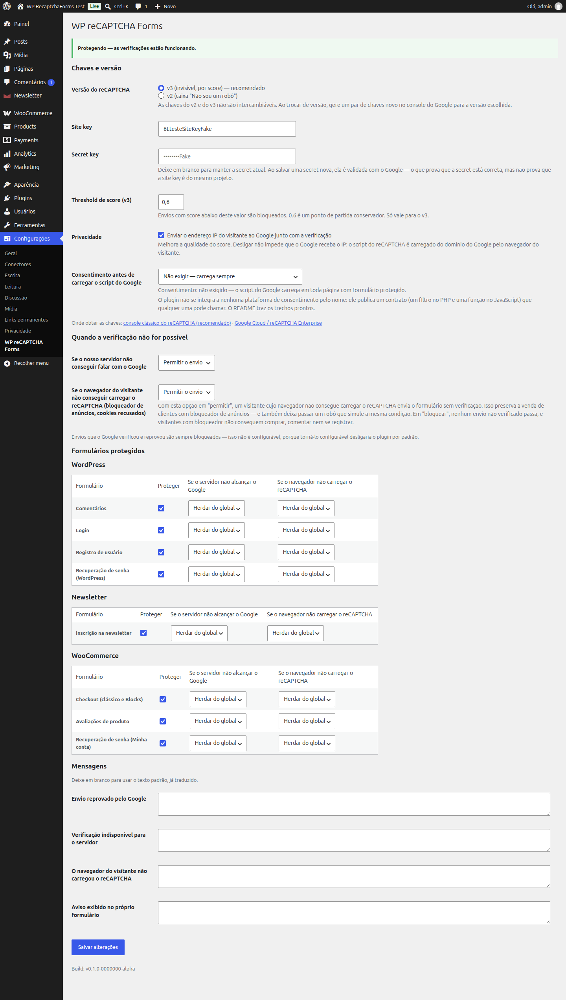

# WP reCAPTCHA Forms

> 🇺🇸 **[Read this in English → README-EN.md](README-EN.md)**

Protege os formulários do WordPress, do WooCommerce e do plugin Newsletter com o reCAPTCHA
do Google — com política de falha configurável e sem quebrar cache de página.

- **Requer:** PHP 7.4+ · WordPress 6.0+ · (opcional) WooCommerce 7.0+ para o checkout clássico e 8.3+ para o Blocks
- **Licença:** [GPL-2.0-or-later](LICENSE)
- **Estado:** em desenvolvimento, ainda sem release pública

---

## Índice

- [Por que este plugin existe](#por-que-este-plugin-existe)
- [Formulários suportados](#formulários-suportados)
- [Instalação](#instalação)
- [Obtendo as chaves do Google](#obtendo-as-chaves-do-google)
- [Configuração](#configuração)
- [Quando a verificação não é possível](#quando-a-verificação-não-é-possível)
- [Privacidade](#privacidade)
- [Consentimento e CMP](#consentimento-e-cmp)
- [Kill switch](#kill-switch)
- [API pública](#api-pública)
- [FAQ](#faq)
- [Traduções](#traduções)
- [Licença](#licença)

---

## Por que este plugin existe

**A tese é cobertura, não sofisticação.** Não existe plugin gratuito que cubra, junto e no
mesmo lugar, comentário + registro + login + recuperação de senha + newsletter + checkout
do WooCommerce (clássico **e** Blocks) + avaliações de produto, com reCAPTCHA v3 e v2.
Existem plugins que fazem alguns desses formulários muito bem, e planos pagos que fazem o
resto. Este faz a lista inteira.

O que ele **não** faz, dito na abertura para você não descobrir depois:

- **Um único threshold de score**, global. Isso é decisão de design, não limitação: um
  threshold por formulário multiplica a superfície de configuração e a persona que
  precisa dele é rara. Se você precisa, o filtro `wp_recaptcha_forms_verdict` te dá a
  decisão inteira.
- **Sem telemetria, sem relatórios, sem histórico de bloqueios.** Não há tabela nova no
  banco. O que existe são dois contadores em transient de uma hora, usados só para um
  aviso de diagnóstico, e que morrem sozinhos.
- **Não é aconselhamento jurídico.** O texto de privacidade pronto (abaixo) é um ponto de
  partida, e não torna a sua instalação conforme à LGPD ou ao GDPR.

---

## Formulários suportados

| Origem | Formulário | `form_id` | Observação |
|---|---|---|---|
| WordPress | Comentários | `wp_comment` | Não se aplica a avaliações de produto do Woo (essas têm linha própria) |
| WordPress | Login | `wp_login` | Só o formulário HTML do `wp-login.php`. XML-RPC, REST, WP-CLI, cron e usuário já logado ficam de fora |
| WordPress | Registro de usuário | `wp_register` | |
| WordPress | Recuperação de senha | `wp_lostpassword` | |
| Newsletter (Stefano Lissa) | Inscrição | `newsletter_subscribe` | |
| WooCommerce | Checkout | `woocommerce_checkout` | Cobre o **clássico** (shortcode) e o **Blocks** (Store API) — os dois caminhos, com o mesmo veredito |
| WooCommerce | Avaliações de produto | `woocommerce_review` | |
| WooCommerce | Recuperação de senha (Minha conta) | `woocommerce_lostpassword` | |

**Fora de escopo, de propósito:** redefinição de senha por link do e-mail (o link já é o
fator de autenticação) e qualquer caminho de autenticação que não seja o formulário HTML
do `wp-login.php`.

---

## Instalação

1. Baixe o `.zip` da [página de releases](https://github.com/gustavo8000br/wp-recaptcha-forms/releases).
2. No painel: **Plugins → Adicionar novo → Enviar plugin**, escolha o `.zip` e instale.
3. Ative.
4. Vá em **Configurações → WP reCAPTCHA Forms** e informe as chaves.

Até você informar a site key e a secret key, o plugin fica em estado **"ainda não
configurado"**: não imprime campo, não carrega script e não bloqueia nada.

---

## Obtendo as chaves do Google

Existem dois caminhos, e eles **não** produzem chaves intercambiáveis.

> **Verificado em 2026-09-09.** O Google reorganiza estas páginas com alguma frequência;
> se algum link abaixo mudar, abra uma issue.

### Caminho 1 — console clássico do reCAPTCHA · *recomendado*

**https://www.google.com/recaptcha/admin**

1. Entre com uma Conta Google.
2. Clique em **+** para registrar um site novo.
3. **Rótulo:** qualquer nome que te ajude a achar depois.
4. **Tipo:** escolha **reCAPTCHA v3** (recomendado) ou **reCAPTCHA v2 → "Não sou um robô"**.
5. **Domínios:** o domínio do site, sem `https://` e sem barra final. Acrescente também os
   domínios de staging, se houver — errar aqui produz `exec-error` no navegador do
   visitante, não um erro no seu painel.
6. Aceite os termos e envie.
7. Copie a **site key** e a **secret key**.

> ⚠️ **O Google marcou este console como em depreciação**, empurrando novos projetos para
> o reCAPTCHA Enterprise no Google Cloud. Ele continua funcionando e continua gratuito,
> e é por isso que segue sendo o caminho recomendado aqui — mas conte com uma migração no
> futuro.

### Caminho 2 — reCAPTCHA Enterprise via Google Cloud Console

**https://console.cloud.google.com/security/recaptcha**
(documentação: https://cloud.google.com/recaptcha/docs/create-key-website)

1. Crie ou selecione um projeto no Google Cloud.
2. **É necessário habilitar o faturamento no projeto.** Sem eufemismo: o Google exige um
   cartão cadastrado, mesmo dentro da cota gratuita. Há uma cota mensal gratuita generosa
   para sites pequenos, mas o cadastro é obrigatório e o excedente é cobrado.
3. Ative a API **reCAPTCHA Enterprise**.
4. Crie uma chave do tipo **Website**, escolhendo entre pontuação (equivalente ao v3) ou
   caixa de seleção (equivalente ao v2).
5. Registre os domínios.
6. A **site key** aparece na listagem. A **secret key** é a chave de API legada; se você
   for usar este plugin, gere-a em **Configurações legadas / Legacy secret key** na mesma
   tela da chave.

### Qual escolher

| | Console clássico | Enterprise |
|---|---|---|
| Custo | gratuito, sem cartão | exige faturamento habilitado |
| Complexidade | 6 cliques | projeto GCP, API, IAM |
| Futuro | em depreciação | é para onde o Google está indo |
| **Recomendação para este plugin** | **sim** | só se você já vive no GCP |

### Um aviso honesto sobre a validação de chave

Ao salvar uma secret key nova, o plugin a testa contra o Google na hora. Essa sonda pega
o erro grosseiro — secret com um caractere trocado, secret colada no campo errado
(`invalid-input-secret`).

**Ela NÃO detecta um par site key / secret key vindo de projetos diferentes.** O endpoint
de verificação do Google nem recebe a site key, então não há como perguntar a ele se as
duas combinam. Por isso a mensagem na tela diz *"secret validada"*, e nunca *"chaves
validadas"* — a diferença é real.

Esse caso residual é pego depois, em produção, pelo aviso de runtime: se **todas** as
verificações recentes falharem (mínimo de 10, 100% de recusa), o plugin exibe um aviso
dizendo que a causa mais provável são chaves de projetos diferentes. Nenhum veredito muda
por causa desse aviso — ele é diagnóstico puro.

---

## Configuração

**Configurações → WP reCAPTCHA Forms**



| Opção | Default | O que faz |
|---|---|---|
| Versão do reCAPTCHA | `v3` | v3 é invisível e decide por score; v2 mostra a caixa "Não sou um robô". **As chaves não são intercambiáveis** |
| Site key / Secret key | vazias | A secret nunca é ecoada de volta; deixe o campo em branco para manter a atual |
| Threshold de score | `0.6` | Só vale para o v3. Envios abaixo disso são bloqueados |
| Enviar IP ao Google | ligado | Melhora a qualidade do score. Ver [Privacidade](#privacidade) |
| Consentimento | `não exigir` | Ver [Consentimento e CMP](#consentimento-e-cmp) |
| Política de falha (2 eixos) | `permitir` | Ver a seção seguinte |
| Formulários protegidos | todos ligados | Um toggle e dois eixos de política por formulário |
| Mensagens | vazias | Em branco = usa o texto padrão, já traduzido |

A secret key também pode vir do `wp-config.php`, fora do banco:

```php
define( 'WP_RECAPTCHA_FORMS_SECRET_KEY', 'sua-secret-key' );
```

Com a constante definida, o campo na tela fica desabilitado e sem `name` — não há como
sobrescrevê-la pelo painel.

---

## Quando a verificação não é possível

Existem **quatro** desfechos possíveis, e cada um tem dono diferente. É a decisão de
desenho mais importante do plugin, então vale a tabela:

| Classe | O que aconteceu | De quem é o problema | Política | Configurável? |
|---|---|---|---|---|
| **Reprovado** | O Google respondeu e reprovou o envio | do visitante (ou do robô) | **sempre bloqueia** | **não** |
| **Servidor sem Google** | O seu servidor não conseguiu falar com o Google | rede/infra; você pode agir | permitir (default) | sim, 2 níveis |
| **Chaves erradas** | O Google recusou as chaves | você, operador | permite + aviso máximo no painel | por filtro |
| **Navegador sem Google** | O navegador do visitante não carregou o reCAPTCHA | ninguém — é o mundo | permitir (default) | sim, 2 níveis |

**"Reprovado" não é configurável de propósito.** Torná-lo configurável desligaria o plugin
por padrão na primeira vez que alguém escolhesse "permitir", e é justamente o único caso em
que temos certeza de que o Google avaliou e disse não.

### O que você está comprando ao deixar "navegador sem Google" em *permitir*

> Com esta opção em "permitir", um visitante cujo navegador não consegue carregar o
> reCAPTCHA envia o formulário sem verificação. Isso preserva a venda de clientes com
> bloqueador de anúncios — **e também deixa passar um robô que simule a mesma condição**.
> Em "bloquear", nenhum envio não verificado passa, e visitantes com bloqueador não
> conseguem comprar, comentar nem se registrar.

Não há como tornar esse sinal infalsificável: qualquer prova que o navegador possa produzir
sem falar com o Google, um script também produz. O plugin não gasta complexidade fingindo
o contrário — gasta em deixar a escolha explícita.

Um robô que simplesmente **não envia nada** continua bloqueado, mesmo em "permitir". A
diferença entre "não enviou token" e "declarou que não conseguiu obter token" é o que
separa os dois casos.

### O que o visitante vê

Quando o navegador não consegue carregar o reCAPTCHA, aparece um aviso no próprio
formulário, antes do envio prosseguir:

> *Não foi possível carregar a verificação de segurança do Google. Se você usa bloqueador
> de anúncios ou recusou os cookies, desative-o para esta página e tente novamente.*

Em "permitir", é só um aviso — o envio funciona. Em "bloquear", a recusa vem com uma
mensagem **própria**, diferente da de "reprovado": o visitante precisa saber que o problema
é o bloqueador dele, não que ele foi confundido com um robô.

---

## Privacidade

O plugin fornece um texto de aviso pronto para você colar na sua política de privacidade,
**e ele reflete a configuração real da sua instalação** — se o envio de IP está ligado ou
desligado, e se o script está sob consentimento.

Três formas de usá-lo:

```php
// 1. Função
echo wp_recaptcha_forms_privacy_notice();
echo wp_recaptcha_forms_privacy_notice( array( 'format' => 'plain' ) );
```

```text
2. Shortcode
[wp_recaptcha_forms_privacy_notice]
[wp_recaptcha_forms_privacy_notice format="plain"]
```

**3. Ferramenta nativa do WordPress:** o texto já aparece em **Configurações → Privacidade
→ guia de política sugerida**, ao lado dos textos dos outros plugins, com botão de copiar.

### O parágrafo que você precisa ler antes de desligar o envio de IP

O toggle *"enviar o endereço IP do visitante ao Google"* controla **apenas** o IP que o
**seu servidor** manda junto com a verificação. Desligá-lo melhora pouco e engana muito:

> Desligar esse envio **não impede** que o Google receba o endereço IP do visitante, porque
> o script do reCAPTCHA é carregado **diretamente do domínio do Google pelo navegador do
> visitante**. O Google vê o IP de qualquer forma.

A mitigação de privacidade que de fato funciona neste plugin é outra, e está ligada por
padrão: **o script do Google só é carregado nas páginas que contêm um formulário
protegido.** Em qualquer outra página do seu site, o navegador do visitante não fala com o
Google por causa deste plugin.

---

## Consentimento e CMP

Um CMP configurado corretamente segura scripts de terceiro até o aceite. Se você tem um,
ligue o modo de consentimento:

| Modo | Comportamento |
|---|---|
| `não exigir` (default) | Carrega o script normalmente |
| `automático` | Consulta a WP Consent API, se houver; sem provedor, comporta-se como "não exigir" |
| `exigir` | **Nunca** carrega sem sinal explícito de consentimento |

**O plugin não se integra com nenhum CMP pelo nome.** Manter N adaptadores para N plugins
que mudam de API sem avisar é dívida garantida num projeto de mantenedor solo. Em vez
disso, ele publica um contrato — e você liga os dois fios com três linhas.

### Complianz

```js
document.addEventListener( 'cmplz_status_change', function () {
    if ( cmplz_has_consent( 'marketing' ) ) {
        window.wpRecaptchaForms.grantConsent();
    }
} );
```

### CookieYes

```js
document.addEventListener( 'cookieyes_consent_update', function ( e ) {
    if ( e.detail && e.detail.accepted && e.detail.accepted.includes( 'advertisement' ) ) {
        window.wpRecaptchaForms.grantConsent();
    }
} );
```

> Os nomes de evento e de categoria acima são **do CMP**, não deste plugin, e mudam sem
> nos avisar. Confira na documentação corrente do seu CMP; a única parte que é contrato
> nosso é a chamada `window.wpRecaptchaForms.grantConsent()`.

### WP Consent API

Nada a fazer: em `automático` ou `exigir`, o plugin já consulta `wp_has_consent()` quando a
WP Consent API está presente. A categoria consultada é `marketing`, e é filtrável — a
classificação do reCAPTCHA como `marketing`, `functional` ou `statistics` é decisão
jurídica sua, não nossa:

```php
add_filter( 'wp_recaptcha_forms_consent_category', fn() => 'functional' );
```

### Qualquer outro caso

```php
// Lado servidor
add_filter( 'wp_recaptcha_forms_consent_granted', function ( $granted, $form_id ) {
    return isset( $_COOKIE['meu_cmp_marketing'] ) ? true : $granted;
}, 10, 2 );
```

```js
// Lado cliente — idempotente, pode ser chamado quantas vezes quiser
window.wpRecaptchaForms.grantConsent();

// ou, por evento
document.dispatchEvent( new CustomEvent( 'wp-recaptcha-forms:consent-granted' ) );
```

Se o consentimento chegar **durante** o preenchimento do formulário, o envio seguinte já
tem token e o visitante nunca vê aviso nenhum.

---

## Kill switch

Quando algo dá errado às 23h e o `wp-admin` não é uma opção:

```php
// wp-config.php
define( 'WRF_DISABLE', true );
```

Desativa **toda** a proteção imediatamente, sem desativar o plugin e sem tocar no banco.
Nenhuma integração é registrada, nenhum script é enfileirado, nenhum campo é impresso,
nenhuma chamada ao Google é feita. Todos os formulários voltam ao comportamento nativo do
WordPress na requisição seguinte.

O que **continua** funcionando de propósito: a tela de configurações abre e é editável
(você precisa poder consertar a chave que te trouxe até aqui), um aviso não-dispensável
aparece em todo o painel, e o Site Health reporta o estado.

`WP_RECAPTCHA_FORMS_DISABLE` funciona como alias, com a mesma semântica.

---

## API pública

Para proteger um formulário que o plugin não conhece:

```php
// No formulário, dentro do <form>:
wp_recaptcha_forms_render_field( 'meu_formulario' );

// Na validação:
$resultado = wp_recaptcha_forms_verify( 'meu_formulario' );

if ( is_wp_error( $resultado ) ) {
    // Devolve WP_Error, nunca exceção: um try/catch obrigatório num plugin de
    // formulário seria fonte de fatal error alheio.
    wp_die( $resultado->get_error_message() );
}
```

```php
wp_recaptcha_forms_is_active( 'meu_formulario' );   // bool
wp_recaptcha_forms_set_consent( true );             // consentimento pelo servidor
wp_recaptcha_forms_privacy_notice();                // texto de privacidade
```

### Filtros

| Filtro | Para quê |
|---|---|
| `wp_recaptcha_forms_verdict` | A decisão final, inteira. É o escape hatch para qualquer regra própria |
| `wp_recaptcha_forms_should_protect` | Ligar/desligar por contexto (por página, por usuário) |
| `wp_recaptcha_forms_client_unreachable_policy` | Política de "navegador sem Google" por formulário |
| `wp_recaptcha_forms_misconfig_policy` | Fail-close opt-in quando as chaves estão erradas |
| `wp_recaptcha_forms_consent_granted` | Decisão de consentimento no servidor |
| `wp_recaptcha_forms_consent_category` | Categoria consultada na WP Consent API |
| `wp_recaptcha_forms_load_timeout` | Prazo do navegador para carregar o script (default 4000 ms) |
| `wp_recaptcha_forms_request_timeout` | Prazo do servidor para falar com o Google |
| `wp_recaptcha_forms_remote_ip` | O IP enviado na verificação |
| `wp_recaptcha_forms_endpoint` | Trocar `google.com` por `recaptcha.net` |
| `wp_recaptcha_forms_privacy_notice_paragraphs` | Ajustar o texto de privacidade |
| `wp_recaptcha_forms_locale_fallbacks` | Mapa de variantes de idioma |

---

## FAQ

### O plugin quebra cache de página?

Não, e isso é requisito de arquitetura, não sorte. O HTML impresso é **idêntico para todo
visitante e eternamente cacheável**: os campos ocultos saem vazios e são preenchidos por
JavaScript no momento do envio. Não há nonce em formulário público — um nonce em página
cacheada seria servido expirado.

**O que você ainda precisa conferir no seu plugin de cache:** a otimização de JavaScript,
não o cache de HTML.

| Plugin | O que excluir |
|---|---|
| **WP Rocket** | Excluir `wp-recaptcha-forms` e `google.com/recaptcha` de *Delay JavaScript Execution* e de *Combine JavaScript files* |
| **LiteSpeed Cache** | Excluir os mesmos dois de *JS Combine* e de *JS Defer / Delayed JS* |
| **Autoptimize** | Acrescentar `wp-recaptcha-forms` e `recaptcha` à lista de exclusão de JS |
| **Cloudflare** | Desligar *Rocket Loader* para as páginas com formulário protegido |

O sintoma de ter esquecido isso é sempre o mesmo: o formulário envia, mas sempre sem token.

### Por que o script é carregado só em algumas páginas?

Porque carregá-lo em todas seria entregar ao Google o IP de todo visitante em toda página,
sem necessidade. O plugin registra o script e só o enfileira quando alguma integração
declara que vai imprimir um campo naquela requisição.

### Um usuário logado precisa passar pelo reCAPTCHA no login?

Não. Se já existe sessão válida, não há robô a barrar.

### O plugin protege login via app oficial, Jetpack ou SSO?

Não, e é deliberado. A proteção de login vale **só** para o formulário HTML do
`wp-login.php`. XML-RPC, REST API (incluindo application passwords), WP-CLI e cron passam
intocados — proteger esses caminhos com um desafio de navegador só produziria lockout.

### Posso ter threshold diferente por formulário?

Não pela tela. Use `wp_recaptcha_forms_verdict`.

### O que acontece se o Google ficar fora do ar?

Por padrão, os envios passam (fail-open) e nada aparece no painel — não é erro seu nem do
visitante. Se você prefere bloquear, mude *"se o nosso servidor não conseguir falar com o
Google"* para "bloquear".

### O plugin cria tabelas no banco?

Não. Uma option de configuração, algumas options de estado e dois transients de uma hora.
A desinstalação varre tudo por prefixo — inclusive as chaves de stories futuras, porque a
varredura é por prefixo e não por lista.

---

## Traduções

O plugin já vem traduzido. `en_US` e `es_ES` são traduções de verdade; `pt_BR` é o idioma
em que as strings foram escritas.

<!-- i18n-progress:start -->

| Idioma | Progresso | Strings |
|---|---|---|
| Português (Brasil) — idioma-fonte (`pt_BR`) | `████████████████████` 100% | 103/103 |
| English (US) (`en_US`) | `████████████████████` 100% | 103/103 |
| Español (`es_ES`) | `████████████████████` 100% | 103/103 |

Gerado por `composer i18n:progress` a partir dos `.po` do diretório `languages/`. Não editar à mão.

<!-- i18n-progress:end -->

Variantes regionais caem no catálogo mantido: `es_MX`, `es_AR`, `es_CO` e mais dez usam o
`es_ES`; `pt_PT` e `pt_AO` usam o `pt_BR`; `en_GB`, `en_CA` e afins usam o `en_US`.

### Como contribuir com uma tradução

O fluxo abaixo é **testado a cada execução do CI** por `bin/i18n-e2e.sh` — instrução não
verificada é instrução errada.

1. **Clone e instale:**
   ```bash
   git clone https://github.com/gustavo8000br/wp-recaptcha-forms.git
   cd wp-recaptcha-forms
   composer install
   ```

2. **Gere o catálogo base** (ou use o `languages/wp-recaptcha-forms.pot` já versionado):
   ```bash
   composer i18n:pot
   ```

3. **Crie o seu `.po`** a partir do `.pot`. Copie
   `languages/wp-recaptcha-forms.pot` para `languages/wp-recaptcha-forms-{locale}.po` —
   por exemplo `wp-recaptcha-forms-fr_FR.po` — e traduza cada `msgstr`.

   Com [Poedit](https://poedit.net/): **Arquivo → Novo a partir de arquivo POT**, escolha o
   `.pot`, selecione o idioma e salve com o nome acima em `languages/`.

4. **Preserve os placeholders.** `%s`, `%1$s` e `%2$s` precisam existir na tradução, na
   mesma quantidade. Trocar a ordem é permitido usando a forma numerada; omitir um
   quebra a mensagem em tempo de execução.

5. **Compile e confira:**
   ```bash
   composer i18n:build          # gera o .mo, sem precisar do msgfmt instalado
   composer i18n:progress       # mostra a sua porcentagem
   ```

6. **Teste no seu WordPress.** Copie o `.po` e o `.mo` para
   `wp-content/plugins/wp-recaptcha-forms/languages/`, mude o idioma do site em
   **Configurações → Geral** e abra **Configurações → WP reCAPTCHA Forms**.

7. **Abra o PR** com o `.po`. Idiomas de comunidade entram só com o `.po`; os três idiomas
   mantidos pelo projeto (`pt_BR`, `en_US`, `es_ES`) entram com `.po` **e** `.mo`, e o CI
   confere que os dois batem.

**O que não traduzir:** nomes próprios (WooCommerce, reCAPTCHA, Google, WordPress),
constantes (`WRF_DISABLE`), nomes de arquivo (`wp-config.php`) e os códigos de erro crus do
Google — a lista fechada está em `languages/i18n-allowlist.txt`.

---

## Desenvolvimento

```bash
composer install
composer test              # suíte unitária, sem rede e sem WordPress
composer lint              # PHPCS/WPCS
composer check:boundary    # vocabulário do Google e $_POST confinados
composer i18n:e2e          # nenhuma string visível fora do pipeline de i18n
```

Ambiente com WordPress de verdade: `cd test-env && docker compose up -d` →
http://localhost:8081.

Ver também [`docs/compatibility-matrix.md`](docs/compatibility-matrix.md) — inclusive a
lista de lacunas conhecidas.

---

## Licença

[GPL-2.0-or-later](LICENSE). O mesmo da licença do WordPress: você pode usar, modificar e
redistribuir, inclusive comercialmente, desde que preserve a licença.
